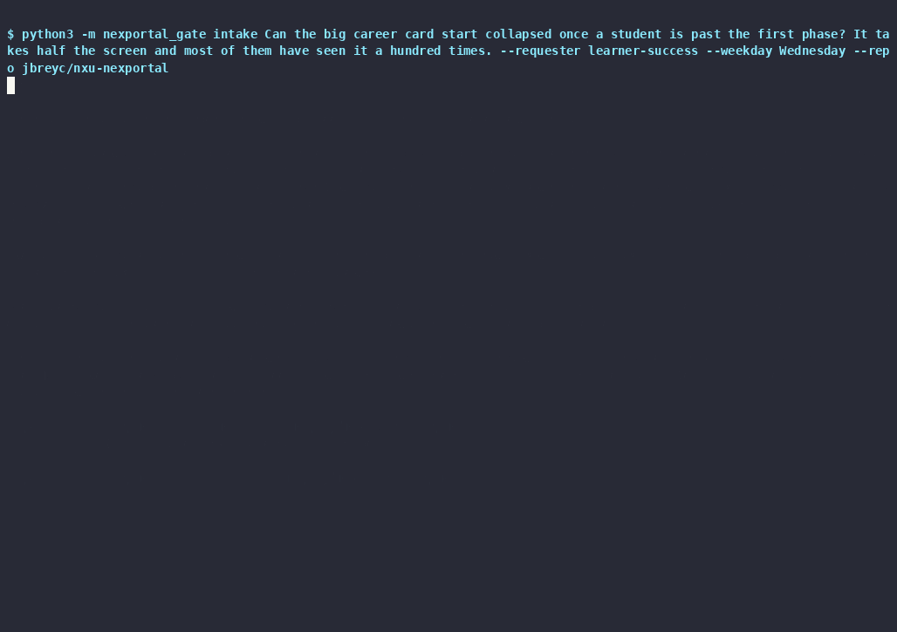

# nxu-nexportal — a readiness gate for NexPortal

A working prototype of the AI piece of NexPortal's operating model: a **readiness gate** at two positions — `intake` at the door (a raw request), `gate` before refinement (a drafted spec) — so nothing unscoped reaches an engineer, and **one enforced rule**: no card moves to Ready without a fresh gate record for the body as it is now. Built for the surfaces the team already has — GitHub issues, a Projects board, the terminal, Claude Code. The writeup is [`WRITEUP.md`](WRITEUP.md); the board is [jbreyc/projects/1](https://github.com/users/jbreyc/projects/1); one issue end to end, recorded, is below.



```
Inbox → Triaged → Drafted → Ready → In Sprint → Done
                      ↑          |
                      └──────────┘  (Needs-info, Reason set)
```

| Command | Position | What it does · what it writes |
|---|---|---|
| `nexportal-gate intake "<text>" --requester <name>` | the door | Structure check → shortlist of open issues it may duplicate → one model call. Files the issue with an `NX-INTAKE:` record (outcome, urgency vs evidence, size + confidence, routed questions, the message back), sets Triaged / Size / Requester. A confirmed duplicate posts the note on the existing issue and creates nothing. |
| `nexportal-gate draft <n>` | Triaged → Drafted | Fills the Definition-of-Ready form from the intake record. A template, no model — the PRD agent is assumed, not built. Open questions ride the body as `NX-OPEN-QUESTION:` lines, so the gate fails on them until answered. |
| `nexportal-gate body <n> --file <spec.md>` | the answered spec | Replaces the body from a file — the questions come off the body and, by construction, the newest record no longer matches (new hash). Warns if the card is Ready. |
| `nexportal-gate gate <n>` | before refinement | Tier 1 (no model): the form's shape. Tier 2 (Claude Code headless, JSON schema): steelman, blocking vs non-blocking ambiguities with owners, untestable criteria, hidden dependencies against [`context/platform.md`](context/platform.md), size, a ≤ 3-item agenda, the message. Posts one `NX-GATE:` record carrying `body_sha256`; sets or clears Reason. The tool disposes of the verdict; the model's own is kept beside it. |
| `nexportal-gate flip <n> <Status>` | the guarded door | Ready needs the newest `NX-GATE:` record to say `ready` **and** to hash to the current body. Refusal: exit 3, nothing written, the command named. |
| `nexportal-gate audit` | the door that can't be locked | Ready items whose newest record is missing, not `ready`, or stale (a card dragged in the web UI). Detect where prevention is impossible. |
| `/intake`, `/gate` + a PreToolUse hook | the Claude Code plugin | The two commands call the CLI and relay the record. The hook denies a raw `gh project item-edit` on this board's Status and points at `flip` — [`hooks/DENIAL.md`](hooks/DENIAL.md) is a live transcript. |

## Verify it — three postures

**1. Nothing installed — read the trail.**

| Issue | What it shows |
|---|---|
| [#1](https://github.com/jbreyc/nxu-nexportal/issues/1) | The referral brief from Part 0 Q3, three versions on one trail. v1 (fixture 01) → `NX-GATE: needs-info` with five blocking gaps (prompt v1); v2 → `needs-info` under prompt v1, a **refused flip**, then `ready` under prompt v2 and flipped; v3 — the brief as it stands in Part 0 Q3 (`seed/01-referral-brief-v3.md`) — → `needs-info` on one untestable criterion, fixed, `ready`, flipped. Also the duplicate note from fixture 06. |
| [#2](https://github.com/jbreyc/nxu-nexportal/issues/2) | The vague spec: shape passes; `needs-info` under both prompts (no problem statement, three untestable criteria); a refused flip — the wall wrote nothing. |
| [#3](https://github.com/jbreyc/nxu-nexportal/issues/3) | The CEO's chatbot, through the door: `NX-INTAKE:` (no learner outcome, XL, the message that names Thursday and what moves out) → `draft` → `gate` fails Tier 1 at the first open question. |
| [#4](https://github.com/jbreyc/nxu-nexportal/issues/4) | Marketing's Friday ask: triaged; the message separates the Monday extract from the dashboard. |
| [#5](https://github.com/jbreyc/nxu-nexportal/issues/5) | The trap: Tier 1 passes a well-formed spec; Tier 2 names — under both prompts — whether the payments provider can allocate one payment to a chosen set of invoices. |
| [#6](https://github.com/jbreyc/nxu-nexportal/issues/6) | The deadline rail, three generations: v1, v2 and v3 each drew finer blocking findings under prompt v1 (the calibration lesson below); v3 under prompt v2 → `ready` → flipped. |
| [#11](https://github.com/jbreyc/nxu-nexportal/issues/11) | The recorded demo, CLI end to end in two minutes: `intake` → `draft` (five open questions) → `gate` fails Tier 1 → `flip` refused → `body` with the answered spec → `gate` `ready` → `flip` allowed. [`demo/transcript.md`](demo/transcript.md), [`demo/nexportal-gate.cast`](demo/nexportal-gate.cast). [#10](https://github.com/jbreyc/nxu-nexportal/issues/10) is the earlier take of the same chain; re-running its request was refused as a duplicate — by design. |

The six pre-registered cases: [`fixtures/results.md`](fixtures/results.md) (prompt v2, 4/6) and [`fixtures/results.v1.md`](fixtures/results.v1.md) (prompt v1, 3/6). The verdicts in [`fixtures/expected.json`](fixtures/expected.json) were frozen before the first run and never edited — git history is the proof; misses stay in the table with a reading.

**The calibration lesson.** Prompt v1 defined *blocking* as "an engineer would have to guess mid-build" — and by that bar every real spec has something, forever: three generations of the rail each produced a new layer of true-but-finer findings. The gate sits *before* refinement; its job is to make refinement possible, not to replace it. Prompt v2 ([`prompts/system.md`](prompts/system.md), commit `b8c7256`, made before any re-run) defines blocking as *refinement cannot settle it in the room — the requester must supply something the team does not have*. Under v2 the two specs that had earned it reached Ready; the vague spec and the trap did not. Pre-registration made the miscalibration visible in an afternoon.

**2. Clone, no key — reproduce the table and run the tests.** Python 3.11+, stdlib only.

```
git clone https://github.com/jbreyc/nxu-nexportal && cd nxu-nexportal
python3 -m nexportal_gate fixtures --replay      # the six cases from the recorded responses → fixtures/results.md
python3 -m pytest -q                             # 136 tests, no network, no model
python3 -m nexportal_gate gate --file fixtures/02-vague-dashboard.md --replay   # one record, printed
```

**3. With Claude Code (logged in) and `gh` (with the `project` scope) — run it live.**

```
python3 -m nexportal_gate fixtures                # the six cases, live (~7 min); --record to refresh the recordings
python3 -m nexportal_gate gate 2                  # against the demo repo: posts the record, sets Reason
python3 -m nexportal_gate flip 2 Ready            # refused, exit 3
python3 -m nexportal_gate audit                   # clean
REQUEST="…" SPEC=seed/your-spec.md bash scripts/demo.sh   # one fresh request end to end (what the recording shows)
claude --plugin-dir .                             # then: /gate 2 · /intake "…" --requester you
```

Inside that session, ask Claude to run a raw `gh project item-edit` on the board: the hook denies it with the reason ([`hooks/DENIAL.md`](hooks/DENIAL.md)).

## Layout

```
nexportal_gate/   text · shape (Tier 1) · adversary (Tier 2, three clients) · intake · draft · records · board (the wall) · fixtures · seed · __main__
prompts/          system.md (versioned; v2) · gate.md · intake.md · the two JSON schemas
context/          platform.md — the stated assumptions the gate judges hidden dependencies against
fixtures/         the six cases · expected.json (frozen) · recorded/ · results.md · results.v1.md · readings.json · open-issues.json
seed/             the brief's v2 and v3 (v3 is issue #1's body), the rail's v2 and v3, the four fillers, the two demo takes' answered specs
demo/ scripts/    the recording (.cast, .gif, transcript) and the script that produced it
hooks/ commands/ .claude-plugin/   the Claude Code plugin
.github/ISSUE_TEMPLATE/   spec.yml — the form IS the Definition of Ready · request.yml — the stakeholder door
board.toml        the board's identifiers (rendered by `nexportal-gate board-ids`)
```

## Limits, stated

- The duplicate shortlist reads the first 100 open issues; `audit` the first 100 board items; an issue's board membership its first 20 project items. Enough for a team's board, not paginated.
- `board-ids` expects the fields to be named Status, Reason, Size and Requester. `seed` is one-shot: a rerun creates a second set.
- The plugin's hook locks the raw door only when `board.toml` is at the plugin root or the working directory.
- A replay describes the recorded run: `fixtures --replay` says which prompt version the responses were recorded under and warns when it is not the current one. Model calls time out at 300 s (`--timeout`).
- The recordings are one run, and the adversary is not deterministic across runs: re-running fixtures 02 and 03 under the same prompt v2 with only the requester handle changed moved 02's blocking-ambiguity count from two to one (verdict unchanged) and dropped the displacement line from 03's message (its `message mentions any of …` predicate went from pass to miss — 4/6 became 3/6). The pre-registered expectations are the fixed point; the results table is a sample. That second run is kept in git history (`79b9b68`).
- The live `intake` / `draft` / `flip` paths are tested against fakes at the function level and, for `gate` and `intake`, through the CLI; `fixtures` and `gate --file` are tested end to end.

## Assumptions, stated

- [`context/platform.md`](context/platform.md) is everything the gate knows about NexPortal — the facts the fixtures and the specs on the board lean on. Correct it and the judgement moves with it.
- The team runs Claude Code. The adversary is `claude -p --json-schema` on the existing subscription — no SDK, no API key. If not, `adversary.py`'s `Client` protocol takes a small SDK client.
